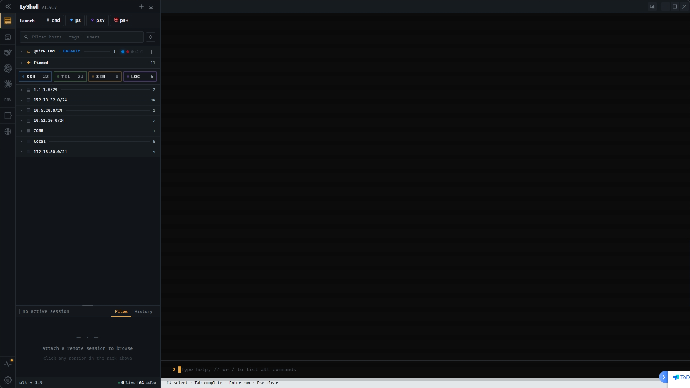
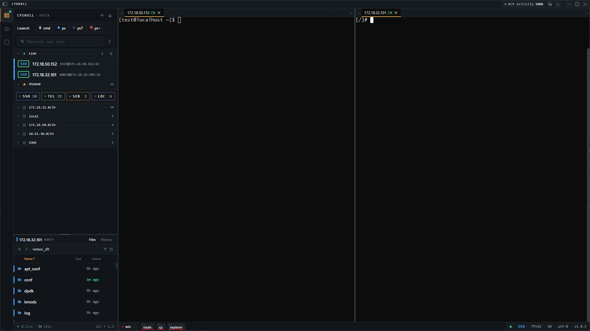
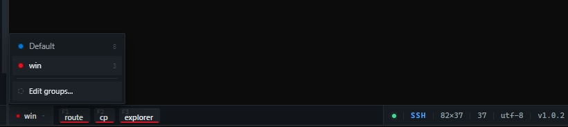
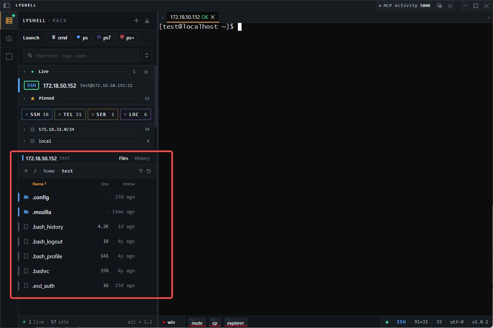
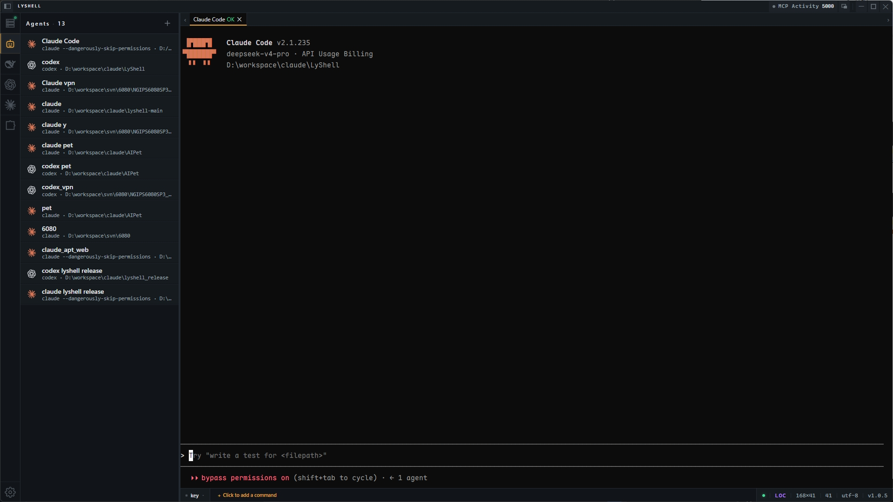
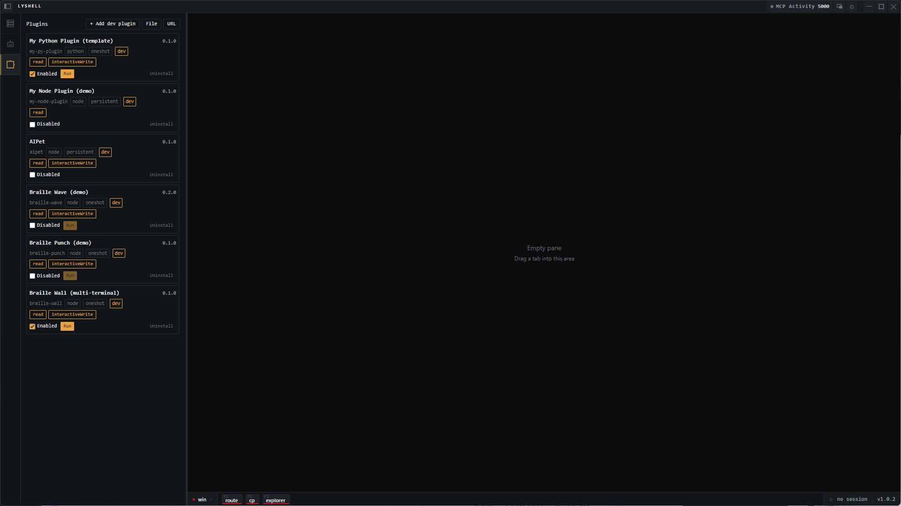
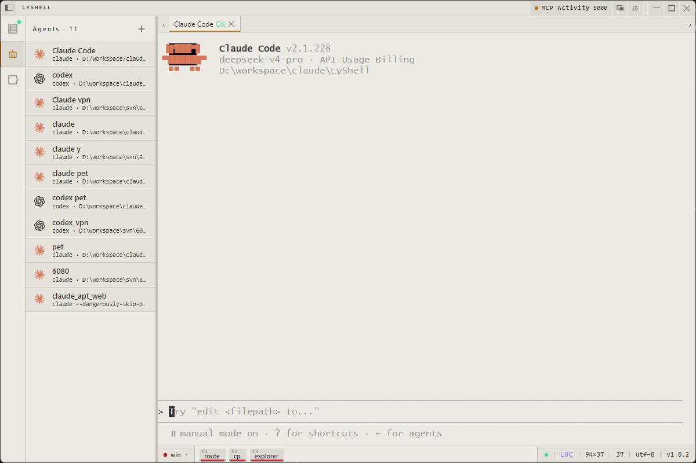

<p align="center">
  
  
  
  
</p>

# 💻 LyShell

> 🤖 A Windows terminal workstation for ops engineers and developers — SSH, Telnet, serial, and local PTY in one app, with built-in SFTP file manager, AI Agent launcher, Python scripting engine, plugin system, and MCP API.

**English** | [简体中文](README.zh.md)

[📖 Usage Guide](#-usage-guide) · [📥 Install](#-install) · [✨ Features](#-features) · [🔌 Connections](#-connection-types) · [🖥️ Terminal](#-terminal) · [📂 Files](#-file-manager) · [🤖 Agents](#-ai-agents)<br>[🧩 Plugins](#-plugin-system) · [🐍 Python](#-python-scripting) · [🔗 MCP](#-mcp-integration) · [🎨 Themes](#-themes) · [⌨️ Shortcuts](#-keyboard-shortcuts) · [❓ FAQ](#-faq)

---

<p align="center">
  
</p>

---

## 📖 Usage Guide

### UI Layout

```
┌──────────────────────────────────────────────────────────┐
│  Title Bar  │  Tabs (session tabs × N)           │ ⚙ — ✕ │
├────────────┬─────────────────────────────────────────────┤
│            │                                             │
│  Activity  │                                             │
│  Rail      │          Terminal / Split Panes             │
│  (sidebar) │                                             │
│            │                                             │
│  ┌───────┐ │                                             │
│  │Session│ │   🔍 Search                                 │
│  │ List  │ │                                             │
│  │       │ │                                             │
│  │ sess1 │ │                                             │
│  │ sess2 │ │                                             │
│  │  ...  │ │                                             │
│  └───────┘ │                                             │
│  ┌───────┐ │                                             │
│  │ Agent │ │                                             │
│  │ Quick │ │                                             │
│  │Launch │ │                                             │
│  └───────┘ │                                             │
│  ┌───────┐ │                                             │
│  │ File  │ │                                             │
│  │ Panel │ │                                             │
│  └───────┘ │                                             │
├────────────┴─────────────────────────────────────────────┤
│  Quick Commands Bar  │  Cols×Rows  │  Status             │
└──────────────────────────────────────────────────────────┘
```

| Area | What it does |
|------|-------------|
| **Activity Rail** | Switch between Sessions, Agents, File Manager, Plugins |
| **Session List** | Click to connect, right-click menu, hover actions (✏️ 📋 📌 🗑️) |
| **Agent Quick Launch** | One-click Claude Code, Aider, Copilot CLI, and custom agents |
| **File Panel** | SSH remote file browser — drag to upload, double-click to download |
| **Terminal Area** | Main canvas — split panes, tabs, drag-to-split, in-terminal search |
| **Quick Commands Bar** | Configurable buttons — click to run, `Ctrl+F1–F12` to trigger |
| **Status Bar** | Cols×Rows (click to clear screen), scrollback lines (click to bottom / double-click to clear), connection state, encoding |
| **Title Bar** | ⚙ Settings, 📊 MCP Audit Panel, float window toggle |

### First Launch

#### 1️⃣ Create Your First SSH Session

1. Click the **+** button at the top of the session list to create a new connection
2. Choose **SSH**, fill in:

| Parameter | Description | Default |
|-----------|-------------|---------|
| Name | Friendly label, e.g. "Production Web" | - |
| Host | Server IP or hostname | - |
| Port | SSH port | `22` |
| Username | Login user | - |
| Password / Private Key | Authentication | - |
| Shell Enter Commands | Commands to run after login, one per line | - |
| Shell Enter Wait | Delay between commands (ms) | `1000` |
| Keepalive Interval | Heartbeat interval (seconds) | - |
| Connection Timeout | Ready timeout (ms) | - |
| Encoding | Terminal charset | UTF-8 |

3. Click **Connect** — the tab indicator turns 🟢 green

> 💡 **Network device login**: For switches/routers needing `shell` → `enable`, add those commands line by line in Shell Enter Commands. LyShell sends them sequentially.

#### 2️⃣ Startup Commands

Edit the session to add startup commands — one per line. Auto-executed after login for cd, env setup, device privilege escalation, etc.

#### 3️⃣ Quick Connect Anytime

`Ctrl+Alt+F` from any app → search → Enter to connect.

<p align="center">
  
</p>

### Daily Workflows

#### 🖥️ Multi-Server Monitoring (Split Panes)

<p align="center">
  
</p>

1. Click a session to open it
2. `Ctrl+Shift+V` split vertically
3. Click another session — opens in new pane
4. `Ctrl+Shift+H` split horizontally
5. Drag dividers to resize

Layout auto-saved, restored on restart.

#### ⌨️ Log Tailing with Quick Commands

1. Right-click the quick commands bar → **Edit Group**
2. Add commands: `tail -f /var/log/syslog`, `tail -f /var/log/nginx/access.log`...
3. Switch tabs, click command or press `Ctrl+F1`/`Ctrl+F2`

Create groups per server role ("Web Tier", "DB Tier"...), up to 12 commands × 5 groups.

<p align="center">
  
</p>

#### 📂 File Transfer

- **Upload** — drag from desktop to File Panel
- **Download** — double-click remote file or right-click → Download
- **Progress** — real-time speed + ETA, auto MD5 on completion
- **Security** — TCP-over-SSH tunnel on SFTP failure, no plaintext fallback

#### 🤖 AI Agent in Context

Sidebar → click Claude Code / Aider / Copilot CLI → launches in current directory → close tab, gone. Transient sessions, no clutter.

#### 🐍 Python Automation

```python
sessions = LyShell.list_sessions(tag="prod-env")
for s in sessions:
    LyShell.connect(s.id)
    LyShell.wait_for("$")
    LyShell.execute("uptime")
    LyShell.execute("df -h /")
```

Activity Rail → Python panel → paste/load → execute. Drives the terminal automatically.

### Session Management

| Action | How |
|--------|-----|
| 📌 Pin | Hover card → click 📌 |
| 📋 Clone session | Double-click tab left half |
| ⚡ Clone channel (no re-auth) | Double-click tab right half (SSH only) |
| 🔍 Search | Type name/host/tag in search box |
| ✏️ Edit | Right-click → ✏️, or hover → click ✏️ |
| 🗑️ Delete | Hover → click 🗑️ |

### Terminal Tips

- Select text → auto-copy | Right-click → paste | Middle-click → search bar
- `Ctrl+F` → in-terminal search (regex, case-sensitive, cross-tab)
- Encoding issues → edit session, switch UTF-8 / GBK / GB2312
- **Clear screen** — click the `cols × rows` indicator in the bottom-right status bar (sends `Ctrl+L`, keeps scrollback)
- **Clear scrollback** — click the buffer-line counter in the bottom-right status bar (single click scrolls to bottom, double-click clears)

---

## 📥 Install

Download the latest build from [Releases](https://github.com/liangyou09/lyshell_release/releases). **No installation needed** — the portable build runs straight after download, nothing to install.

| Platform | Format | Architecture |
|----------|--------|--------------|
| 🪟 Windows | Portable (.exe) — download and run | x64 |

**System requirements**: Windows 10 or Windows 11, 64-bit (x64).

> 🚧 Currently **Windows only** — macOS and Linux builds are not yet available.

---

## ✨ Features

| Category | Details |
|----------|---------|
| 🔌 **Multi-protocol** | SSH, Telnet, serial, local PTY — one window |
| 🪟 **Split panes** | Horizontal/vertical splits, drag-to-split, tab swapping, layout persistence |
| ⌨️ **Quick commands** | Grouped bar, right-click to edit, `Ctrl+F1–F12` keybindings |
| 📂 **File manager** | SFTP/SSH browser, drag-drop upload, double-click download, MD5 checksum |
| 🤖 **AI Agents** | Agent-agnostic terminal — run Claude Code, Aider, Copilot CLI, or any custom CLI |
| 🧩 **Plugin system** | Permission-gated host, Python + Node.js plugins, dev/ZIP/URL install |
| 🐍 **Python engine** | Embedded scripting with `LyShell` terminal automation API |
| 🔗 **MCP API** | Standard MCP server, audit log + per-session authorization |
| 🪟 **Float window** | `Ctrl+Alt+F` global hotkey, collapsible hover-to-expand |
| 🌐 **i18n** | Built-in Chinese + English, add languages with JSON |
| 🎨 **Themes** | 5 presets + custom colors, instant switch, no restart |
| 🔒 **Security** | AES-256-CBC encrypted export |
| 💾 **Persistence** | Window size, position, split layout restored on restart |

---

## 🔌 Connection Types

### SSH

Password/private key auth, Keepalive, shell enter commands (sequential post-login), configurable timeout.

**Cloning**: Double-click tab left → new connection (re-auth); double-click right → shared channel (no re-auth)

### Telnet

Raw TCP socket with full Telnet protocol (IAC negotiation).

| Parameter | Description | Default |
|-----------|-------------|---------|
| Host | Target address | - |
| Port | Telnet port | `23` |
| Timeout | Connection timeout (ms) | - |

### Serial

Auto-detects available COM ports.

| Parameter | Options | Default |
|-----------|---------|---------|
| Path | Dropdown selection | - |
| Baud rate | 9600 ~ 921600 | `115200` |
| Data bits | 5 / 6 / 7 / **8** | `8` |
| Stop bits | **1** / 2 | `1` |
| Parity | **none** / even / odd / mark / space | `none` |

### Local

Opens cmd.exe / PowerShell in-app with configurable working directory and environment.

---

## 🖥️ Terminal

GPU-accelerated rendering, full ANSI sequences + 256 colors.

### Quick Reference

| Feature | How |
|---------|-----|
| 🔍 Search | `Ctrl+F` or middle-click, regex/case-sensitive/cross-tab, draggable bar |
| 📜 Scrollback | 1,000 ~ 100,000 lines configurable |
| 🔤 Encoding | UTF-8 / GBK / GB2312 per session |
| 🚀 Startup | Commands auto-executed after connection |
| 📋 Copy/Paste | Select to copy, right-click to paste |
| ⌨️ IME | CJK composition handled |
| ✏️ Cursor blink | Off by default for performance |

### Tab Status

🟢 Connected | 🔴 Error | ⚪ Disconnected | 🔵 Inactive tab has new output

### Terminal Settings

Title bar ⚙ → split into **Terminal** / **MCP** tabs:

| Setting | Range | Default |
|---------|-------|---------|
| Scrollback | 1,000 ~ 100,000 | 10,000 |
| Font size | 8 ~ 32 | 16 |
| Cursor blink | On/Off | Off |

---

## 📂 File Manager

Sidebar panel, SSH only. Independent connection — never blocks the terminal.

<p align="center">
  
</p>

| Action | How |
|--------|-----|
| 📤 Upload | Drag from desktop to File Panel |
| 📥 Download | Double-click remote file / right-click → Download |
| 📋 Context menu | Download, delete, rename, new directory |
| 🔄 Transfer | Worker-thread pool, real-time speed + ETA |
| ✅ Verify | Auto MD5 on download |
| 📜 History | File, size, path, MD5, re-download support |

Download settings → default `~/Downloads/LyShell/`; enable "auto-create server subdirectory" to archive by server name.

---

## 🤖 AI Agents

LyShell is a **clean, agent-agnostic terminal** — it doesn't lock you to any particular AI tool. Just launch whatever CLI agent you use and it runs in a regular terminal like any other session: scrollback, split panes, and IME support all work the same.

<p align="center">
  
</p>

### Built-in Agents

| Agent | Command |
|-------|---------|
| 🧠 Claude Code | `claude` |
| 🤝 Aider | `aider` |
| 🐙 Copilot CLI | `gh copilot` |

### Custom Agents

Any CLI tool can be registered as an agent — the launch bar just runs its shell command:

| Field | Description |
|-------|-------------|
| Name | Display name |
| Command | Shell launch command |
| Icon | Emoji picker / brand icon (auto-matched by command) |
| Working directory | Native folder picker, ESC to close |
| Environment | Extra env vars at launch |

Agent sessions are transient — close tab, gone from list.

---

## 🧩 Plugin System

Permission-gated plugin host. Each plugin runs with its own scoped authorization.

<p align="center">
  
</p>

Plugins are written in two runtimes:

| Runtime | Entry | Lifecycle | Best for |
|---------|-------|-----------|----------|
| 🐍 Python | `main.py` | one-shot / persistent | one-off automation scripts |
| 🟢 Node.js | `main.js` | persistent (shared host) | long-running, timers, event-driven |

**Install methods**: Local dev directory · ZIP import · URL remote install

**Security**: Each plugin runs with its own scoped authorization, and every request is checked against granular permissions (read / write / execute / file / session control). Layered safeguards include path safety, destructive-command confirmation, and shared-terminal locking.

Plugins can list and interact with sessions, run commands, access the file manager, and start controlled processes.

> ⚠️ **Current scope** — plugins activate on startup (`onStartup`) today. Activation on command or connection-type events, and declarative UI contributions, are not wired up yet.

📦 **Ready-to-run examples** — see [`examples/`](examples/) for minimal Python and Node.js plugin demos.

---

## 🐍 Python Scripting

Embedded Python engine with `LyShell` API for terminal automation.

```python
session = LyShell.get_current_session()
LyShell.execute("ls -la")
LyShell.send("hello\n")
LyShell.wait_for("prompt$")
```

| Variable | Description |
|----------|-------------|
| `LYSHELL_SESSION_ID` | Current session ID |
| `LYSHELL_SESSION_TYPE` | ssh / telnet / serial / local |
| `LYSHELL_HOST` | Connection host |
| `LYSHELL_PORT` | Connection port |

Python path auto-detected from system PATH, configurable in settings.

> 💡 Besides the built-in Python panel, the [Plugin System](#-plugin-system) also runs **Node.js** plugins — the better choice for long-running or scheduled tasks.

---

## 🔗 MCP Integration

LyShell serves as an MCP server, letting external AI clients like Claude Code control terminals via the MCP protocol.

### Tools

| Tool | Capability | Description |
|------|-----------|-------------|
| `list_sessions` | `read` | List sidebar sessions |
| `send_input` | `interactiveWrite` | Send text, autoNewline support |
| `send_and_wait` | `interactiveWrite` | Send and capture response, strips echo + ANSI |
| `execute_command` | `execute` | Run via independent exec channel (SSH only) |
| `run_on_sessions` | `execute` | Broadcast command, max 50 sessions, concurrency 10 |
| `read_output` | `read` | Read N lines of terminal output |
| `upload_file` / `download_file` | `fileWrite` | SFTP file transfer |
| `read_file` / `stat_file` / `list_files` | `read` | Remote file inspection, recursive + glob |
| `create_session` | `sessionControl` | Create/reuse saved session, auto-dedup by target |
| `reconnect_session` | `sessionControl` | Reconnect dropped connection |
| `close_session` | `sessionControl` | Disconnect without deleting the saved session |
| `open_connection_dialog` | `sessionControl` | Open the new-connection dialog for user input |
| `read_session_notes` | `read` | Read session summary, notes, tags |
| `write_session_notes` | `sessionMetadataWrite` | Update summary, notes, tags |
| `wait_for_prompt` | `read` | Wait for shell prompt or regex |
| `tail_until` | `read` | Poll output until pattern matches |

### Security

- 🔑 **Per-session authorization** — each terminal gets its own scoped permission
- 🚪 **Capability gates** — enforced server-side on every endpoint
- 🛡️ **Destructive-command check** — scans for `rm -rf`, `dd if=`, fork bombs
- 🔒 **Shared PTY locking** — MCP vs human input never collide
- 📊 **Audit panel** — title bar entry, calendar + filter + pagination

> ⚠️ Full-screen TUI apps (vim, htop, less) are not supported over MCP — ANSI stripping garbles alternate-screen sequences. Use the LyShell UI native terminal instead.

<p align="center">
  
</p>

---

## 🎨 Themes

5 preset themes plus custom colors. Switching applies instantly across the whole interface — terminal canvas, tabs, and panels all change together, no restart needed.

### Presets

| Theme | Style | Dark/Light |
|-------|-------|-------------|
| **Graphite** | Deep graphite + tungsten amber (default) | Dark |
| **Slate** | Blue-tinted slate, same amber accent | Dark |
| **Carbon** | Neutral charcoal, no blue cast | Dark |
| **Ember** | Warm walnut brown + warm amber | Dark |
| **Paper** | Natural warm paper, graphite ink | Light |

Accent and status colors stay consistent across themes — each protocol (SSH, Telnet, serial, local) keeps its own color, so you can tell connection types apart at a glance.

### Custom

Pick a background and an accent color, and LyShell automatically builds a complete, harmonious theme from them — light vs dark is detected for you.

<p align="center">
  
</p>

---

## ⌨️ Keyboard Shortcuts

| Shortcut | Action |
|----------|--------|
| `Ctrl + Alt + F` | Toggle float window |
| `Ctrl + F` | Terminal search |
| `Ctrl + F1` ~ `F12` | Quick command 1–12 |
| `Ctrl + Shift + H` | Horizontal split |
| `Ctrl + Shift + V` | Vertical split |
| Right-click | Paste |
| Middle-click | Search bar |
| Double-click tab left | Clone session |
| Double-click tab right | Clone channel (SSH) |

---

## ⚙️ Configuration

All config stored as JSON in the user data directory:

| File | Content |
|------|---------|
| `sessions.json` | Session configs |
| `preferences.json` | User preferences |
| `quickCommands.json` | Quick command groups |
| `agents.json` | AI Agent definitions |
| `download-history.json` | Transfer history |
| `download-config.json` | Download directory |
| `mcp-server.json` | MCP authorization |

| Platform | Path |
|----------|------|
| Windows | `%APPDATA%\lyshell\` |

AES-256-CBC encrypted export for sessions + quick commands, import with preview and confirm.

---

## ❓ FAQ

<details>
<summary><b>SSH garbled Chinese characters?</b></summary>
Edit the session, switch encoding from UTF-8 to GBK or GB2312.
</details>

<details>
<summary><b>Serial port no output?</b></summary>
Verify port + baud rate → check no other program uses it → some devices need Enter to activate.
</details>

<details>
<summary><b>File manager not showing?</b></summary>
SSH sessions only. Ensure the active tab is an SSH connection.
</details>

<details>
<summary><b>How to reset all configuration?</b></summary>
Delete all JSON files in the user data directory and restart.
</details>

<details>
<summary><b>Ctrl+Alt+F not working?</b></summary>
May be taken by another app. Reconfigure in LyShell settings.
</details>

<details>
<summary><b>Where are downloaded files?</b></summary>
Default `~/Downloads/LyShell/`. Change in settings; enable "auto-create server subdirectory" to archive by server name.
</details>

---

## 📄 License

MIT © LyShell Team

---

<p align="center">
  <a href="https://github.com/liangyou09/lyshell_release">GitHub</a> ·
  <a href="https://github.com/liangyou09/lyshell_release/issues">Issues</a> ·
  <a href="https://github.com/liangyou09/lyshell_release/releases">Releases</a> ·
  <a href="CHANGELOG.md">Changelog</a> ·
  <a href="CONTRIBUTING.md">Contributing</a>
</p>
