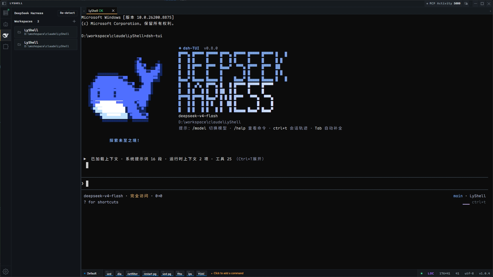
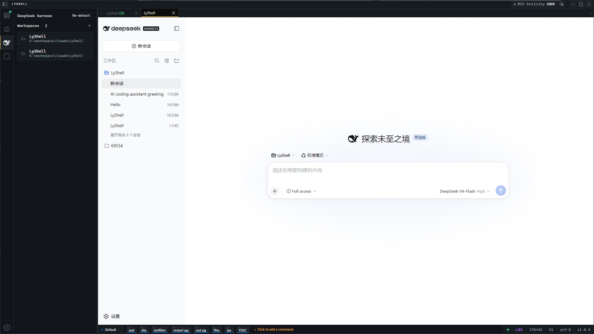

<p align="center">
  
  
  
  
</p>

# 💻 LyShell

> 🔌 **你的终端，也是 AI 的终端。** LyShell 是一款内置 MCP 服务端的 Windows 终端 — 让 Claude Code 等 AI 客户端直接操控你的 SSH / Telnet / 串口 / 本地 PTY 会话。还集成了 AI Agent 启动栏、插件系统和 Python 脚本引擎。

**简体中文** | [English](README.md)

[✨ 核心亮点](#-核心亮点) · [🐋 DeepSeek Harness](#-deepseek-harness) · [🔗 MCP 集成](#-mcp-集成) · [🤖 AI Agent](#-ai-agent) · [🧩 插件与脚本](#-插件系统--python-脚本) · [🚀 快速上手](#-快速上手) · [❓ 常见问题](#-常见问题)

---

## ✨ 核心亮点

| | |
|---|---|
| 🔗 **MCP 服务端** — 将终端暴露给 AI 客户端，会话级授权 + 审计日志 | 🤖 **Agent 启动栏** — 一键启动 Claude Code / Aider / Copilot CLI / 任意自定义 CLI |
| 🧩 **插件系统** — Python + Node.js 插件，细粒度权限隔离 | 🐍 **Python 引擎** — 内置 `LyShell` API 驱动终端自动化 |
| 🐋 **DeepSeek Harness** — 管理工作区，按工作区环境变量 + 模型预设，一键启动 TUI 或内嵌 Web UI | 🔐 **内嵌 Web UI** — 应用内 `<webview>` 标签页运行 `dsh web`，回环锁定 + URL 校验 |

---

<p align="center">
  
</p>

---

## 📥 安装

从 [Releases](https://github.com/liangyou09/lyshell_release/releases) 下载最新版本 — **免安装**，下载即用。

| 平台 | 格式 | 架构 | 系统要求 |
|------|------|------|----------|
| 🪟 Windows | 便携版 (.exe) | x64 | Windows 10 / 11，64 位 |

> 🚧 目前**仅提供 Windows 版本**，macOS / Linux 暂未发布。

---

## 🔗 MCP 集成

**这是 LyShell 最大的不同。** LyShell 可以作为 MCP 服务端，让 Claude Code 等外部 AI 客户端通过 MCP 协议操控终端 — 列出会话、发送命令、读取输出、传输文件、管理连接，一应俱全。

> 📖 **配置** — 见 [MCP 配置指南](docs/mcp-config.md)。大多数情况下你无需手动配置：从 **Agent 启动栏** 启动 agent，让它自己把 LyShell 配成自己的 MCP 服务端即可。注册配置可输出 **JSON / CLI / TOML** 三种格式，适配不同客户端。

### 工具列表

| 工具 | 能力 | 说明 |
|------|------|------|
| `list_sessions` | `read` | 列出侧边栏会话 |
| `send_input` | `interactiveWrite` | 发送文本，autoNewline 自动补换行 |
| `send_and_wait` | `interactiveWrite` | 发送并捕获响应，自动剥离回显和 ANSI |
| `execute_command` | `execute` / `localExecute` | 独立 exec 通道执行（仅 SSH） |
| `run_on_sessions` | `execute` / `localExecute` | 广播命令，最多 50 会话并发 10 |
| `read_output` | `read` | 读取 N 行终端输出 |
| `upload_file` / `download_file` | `fileWrite` | SFTP 文件传输 |
| `read_file` / `stat_file` / `list_files` | `read` | 远程文件检查，支持递归和通配符 |
| `create_session` | `sessionControl` | 创建/复用会话，同 target 自动去重 |
| `reconnect_session` | `sessionControl` | 重连断开连接 |
| `close_session` | `sessionControl` | 断开连接但不删除已保存会话 |
| `open_connection_dialog` | `sessionControl` | 打开新建连接对话框，供用户手动填写 |
| `read_session_notes` | `read` | 读取会话摘要、说明、标签 |
| `write_session_notes` | `sessionMetadataWrite` | 更新摘要、说明、标签 |
| `wait_for_prompt` | `read` | 等待 Shell 提示符或正则 |
| `tail_until` | `read` | 轮询直到匹配 |

### 安全机制

- 🔑 **会话级授权** — 每个终端拥有独立权限范围
- 🚪 **能力门控** — 每端点服务端强制执行
- 🛡️ **破坏性命令确认** — 扫描 `rm -rf`、`dd if=` 等模式
- 🔒 **共享 PTY 锁定** — MCP 与人工输入不冲突
- 📊 **审计面板** — 标题栏入口，日历选择器 + 过滤 + 分页

> ⚠️ 全屏 TUI（vim、htop、less）不支持 MCP 操作 — ANSI 剥离后交替屏幕为乱码，请用 LyShell 界面原生终端。

<p align="center">
  
</p>

---

## 🤖 AI Agent

LyShell 是**与 Agent 无关的终端** — 不绑定任何特定 AI 工具。启动你正在用的任意 CLI Agent，它就像普通会话一样运行在标准终端里：回滚、分屏、输入法支持一视同仁。

| Agent | 命令 |
|-------|------|
| 🧠 Claude Code | `claude` |
| 🤝 Aider | `aider` |
| 🐙 Copilot CLI | `gh copilot` |

**自定义 Agent**：任意 CLI 工具都能注册 — 名称、命令、图标、工作目录、环境变量。Agent 会话为**瞬态**，关闭标签即消失，不残留。

<p align="center">
  
</p>

---

## 🐋 DeepSeek Harness

为 **DeepSeek Harness** 工作区提供的一等公民之家。在一个专属面板中统一管理工作区，再以终端 TUI **或** 内嵌 Web UI 两种方式启动 — 全程在 LyShell 内完成，无需另开浏览器窗口。

| | |
|---|---|
| 🗂️ **工作区面板** — 创建、编辑、置顶、删除 | 🔧 **按工作区环境变量** — `DEEPSEEK_API_KEY`、`DEEPSEEK_BASE_URL`、`DSH_HOME` 等 |
| 🎛️ **模型预设** — 按工作区保存并切换模型 | 🖥️ **TUI 启动** — 在原生终端标签页运行 `dsh-tui` |

### 启动方式：TUI 或 Web UI

每个工作区支持两种打开方式：

- **终端 TUI** — `dsh-tui` 作为标准终端标签页运行，完整回滚、分屏、输入法一视同仁。
- **内嵌 Web UI** — 以 `dsh web --port 0` 启动；LyShell 从 stdout 解析真实端口，把应用渲染进应用内 `<webview>` 标签页。无需浏览器，也无需手动折腾端口。

### Web UI 视作终端标签页

- **✕ 关闭** — 只有 ✕ 才会真正销毁标签并终止子进程。
- **切走即隐藏** — 切换到其他标签页会隐藏 Web UI，但保留页面状态与 `dsh web` 子进程存活；切回即秒开。

### 安全机制

- 🔒 **回环锁定** — 导航与弹窗被固定在工作区回环源。
- ✅ **URL 校验** — 回显 URL 在 `<webview>` 加载前先校验（回环 + 显式端口、无内嵌凭据）。

<p align="center">
  
</p>

<p align="center">
  
</p>

---

## 🧩 插件系统 & Python 脚本

### 插件系统

权限门控的插件宿主，支持 **Python**（一次性 / 常驻）和 **Node.js**（常驻）插件。可从本地目录、ZIP 或远程 URL 安装。每个插件独立授权，按细粒度权限（读取 / 写入 / 执行 / 文件 / 会话控制）服务端校验，含路径安全、破坏性命令确认、共享终端锁定等多层防护。

> ⚠️ 插件目前按启动事件（`onStartup`）激活；按命令/连接类型事件激活、以及声明式 UI 贡献尚未接通。

📦 开箱即用的示例见 [`examples/`](examples/)。

### Python 脚本引擎

内置 Python 执行引擎，提供 `LyShell` API 驱动终端自动化：

```python
session = LyShell.get_current_session()
LyShell.execute("ls -la")
LyShell.send("hello\n")
LyShell.wait_for("prompt$")
```

环境变量：`LYSHELL_SESSION_ID` · `LYSHELL_SESSION_TYPE` · `LYSHELL_HOST` · `LYSHELL_PORT`

Python 路径自动检测系统 PATH，可在设置中配置自定义解释器。

> 💡 长驻或定时任务建议使用**Node.js 插件**（通过[插件系统](#-插件系统--python-脚本)），更加适合。

---

## 🚀 快速上手

### 首次连接
1. 点击会话列表顶部的 **+** → **SSH**
2. 填写主机、端口、用户名、密码/私钥
3. 点击 **连接**，标签变为 🟢 绿色

> 💡 网络设备需先 `shell` → `enable` 才能进入 CLI？在 **Shell 进入命令** 中逐行写入，LyShell 会自动按序发送。

### 快速连接
`Ctrl+Alt+F` 从任何应用呼出浮窗 → 搜索 → 回车即连。

<p align="center">
  
</p>

### 多机监控
点击会话 → `Ctrl+Shift+V` 垂直分屏 → 点击另一个会话。布局自动保存。

### 文件传输
- **上传**：桌面拖拽到文件面板
- **下载**：双击远程文件，或右键 → 下载
- **进度**：实时速度 + 预估时间，下载完成自动 MD5 校验
- **历史**：记录文件名、大小、路径、MD5，支持重新下载
- **安全**：独立 SSH 连接（不阻塞终端），SFTP 或 TCP-over-SSH 隧道；`AllowTcpForwarding` 禁用不会回退明文
- **下载目录**：默认 `~/Downloads/LyShell/`，可选"自动创建服务器子目录"归档

### 快捷命令
右键快捷命令栏 → **编辑分组** → 添加 `tail -f /var/log/syslog` 等命令。`Ctrl+F1`–`F12` 触发，最多 12 条命令 × 5 组。

### 会话管理
- 📌 置顶 — 悬停卡片 → 点击 📌
- 📋 克隆会话 — 双击标签左半侧
- ⚡ 克隆通道（免重认证） — 双击标签右半侧（仅 SSH）
- 🔍 搜索 — 搜索框输入名称/主机/标签

### 终端技巧
- 选中文本 → 自动复制 · 右键粘贴 · 鼠标中键 → 搜索栏
- `Ctrl+F` → 终端内搜索（正则、区分大小写、跨标签）
- 中文乱码 → 编辑会话，UTF-8 / GBK / GB2312 切换
- 点击右下角「列 × 行」→ 清屏
- 点击缓冲行数 → 滚回底部；双击 → 清空回滚

---

## 🔌 连接类型 & 终端

| 类型 | 关键参数 | 说明 |
|------|---------|------|
| 🖥️ **SSH** | 密码或私钥；端口 `22` | 登录后命令、心跳；双击标签克隆 |
| 📟 **Telnet** | 主机 + 端口 `23` | 完整 IAC 协商 |
| 🔌 **串口** | COM 口，波特率 `115200`（9600–921600），8N1 | 自动检测端口 |
| 💻 **本地 PTY** | cmd.exe / PowerShell | 可配工作目录 + 环境变量 |

**终端**：GPU 加速渲染，完整 ANSI + 256 色。回滚最多 100,000 行。分屏（水平/垂直）、拖拽拆分。快捷命令栏 `Ctrl+F1–F12`。标签状态：🟢 已连接 · 🔴 错误 · ⚪ 未连接 · 🔵 新输出。

---

## 🎨 主题

5 种预设 + 自定义。即时切换，无需重启。

| 主题 | 风格 | 明/暗 |
|------|------|-------|
| **Graphite** | 深石墨 + 钨丝琥珀（默认） | 暗 |
| **Slate** | 偏蓝石板，强调色琥珀 | 暗 |
| **Carbon** | 中性炭灰，无蓝调 | 暗 |
| **Ember** | 暖色胡桃木褐 + 暖琥珀 | 暗 |
| **Paper** | 自然浅纸 · 石墨墨 | 亮 |

**自定义**：选取背景色和强调色，LyShell 自动生成一整套和谐配色。

<p align="center">
  
</p>

---

## ⌨️ 快捷键

| 快捷键 | 功能 |
|--------|------|
| `Ctrl + Alt + F` | 显示/隐藏浮窗 |
| `Ctrl + F` | 终端搜索 |
| `Ctrl + F1` ~ `F12` | 快捷命令 1–12 |
| `Ctrl + Shift + H` | 水平分屏 |
| `Ctrl + Shift + V` | 垂直分屏 |
| 右键 | 粘贴 |
| 鼠标中键 | 搜索栏 |

---

## ⚙️ 配置文件

JSON 文件存储于 `%APPDATA%\lyshell\`：

`sessions.json` · `preferences.json` · `quickCommands.json` · `agents.json` · `download-history.json` · `download-config.json` · `mcp-server.json`

支持 AES-256-CBC 加密导出/导入会话与快捷命令。

---

## ❓ 常见问题

<details>
<summary><b>SSH 连接后中文乱码？</b></summary>
编辑会话，编码从 UTF-8 切换为 GBK 或 GB2312。
</details>

<details>
<summary><b>串口连接后无输出？</b></summary>
确认端口号和波特率正确 → 检查设备管理器未被占用 → 部分设备需回车激活。
</details>

<details>
<summary><b>文件管理器不显示？</b></summary>
仅 SSH 会话可用。确保当前活动标签是 SSH 连接。
</details>

<details>
<summary><b>如何重置所有配置？</b></summary>
删除 `%APPDATA%\lyshell\` 下所有 JSON 文件，重启即可。
</details>

<details>
<summary><b>Ctrl+Alt+F 不生效？</b></summary>
可能被其他应用占用，可在设置中修改。
</details>

<details>
<summary><b>下载的文件在哪？</b></summary>
默认 `~/Downloads/LyShell/`，可在设置中修改。
</details>

---

## 📄 许可证

LyShell 可免费下载使用，但源码暂不开放。**未经许可，禁止反编译与再分发二进制**。详见 [LICENSE](LICENSE)。

© 2026 liangyou 保留所有权利。

---

<p align="center">
  <a href="https://github.com/liangyou09/lyshell_release">GitHub</a> ·
  <a href="https://github.com/liangyou09/lyshell_release/issues">Issues</a> ·
  <a href="https://github.com/liangyou09/lyshell_release/releases">Releases</a> ·
  <a href="CHANGELOG.md">更新日志</a> ·
  <a href="CONTRIBUTING.md">参与贡献</a>
</p>
